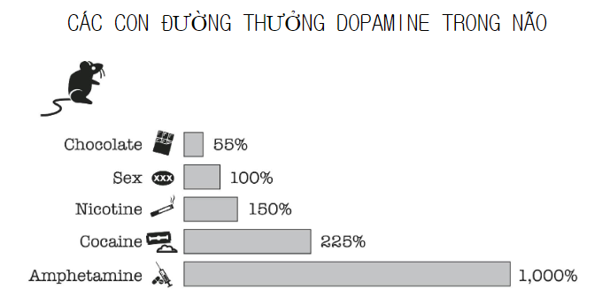
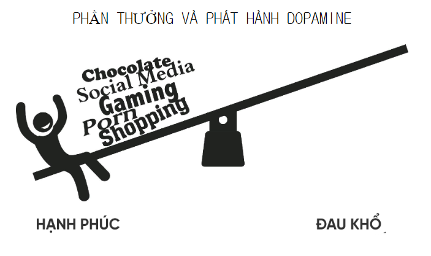
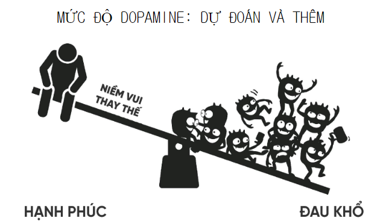
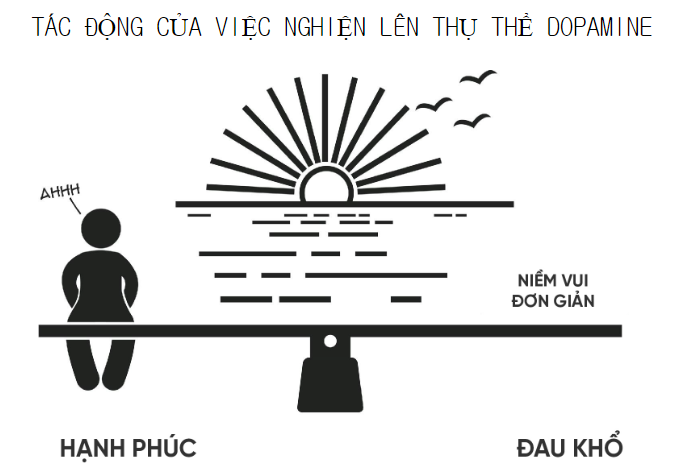

  

Dopamine là một chất dẫn truyền thần kinh quan trọng trong não – như những “tin nhắn hoá học” giúp các tế bào thần kinh giao tiếp hiệu quả. Nó giữ vai trò thiết yếu trong việc tạo ra cảm giác vui vẻ, hứng thú và động lực sống. Khi dopamine ở mức cân bằng, ta cảm thấy tỉnh táo, có mục tiêu và dễ tận hưởng cuộc sống. Nhưng nếu thiếu hụt, cơ thể trở nên chậm chạp, cứng đờ – đây là nguyên nhân chính của bệnh Parkinson. Ngược lại, khi dư thừa dopamine, não sẽ rơi vào trạng thái hưng phấn bất thường, dễ dẫn đến hành vi nghiện và mất kiểm soát cảm xúc.

    

Tác giả Anna Lembke phân tích sâu cơ chế dopamine trong hệ thống “thưởng – phạt” tự nhiên của não...

    

Lembke dùng nhiều câu chuyện thật của bệnh nhân nghiện – từ ma túy, mua sắm, cho tới mạng xã hội – để minh hoạ việc não bị “hỏng” do thẩm thấu quá nhiều dopamine, rồi phải trả giá bằng việc hồi phục cảm xúc.

    

“Dopamine detox” là tạm ngưng các kích thích quá mức để giúp não tái cân bằng. Thay vì trốn tránh nỗi đau, sách khuyên nên đối diện, học cách chịu đựng cảm giác buồn, trống rỗng và căng thẳng để tránh lệ thuộc...

    

<i>Cuốn sách này như một chiếc la bàn giúp mình lần đầu tiên nhìn thấy rõ cách dopamine vận hành trong chính mình – từ niềm vui giả tạo đến vòng lặp gây nghiện. Trong thế giới đầy cám dỗ và tiện lợi ngày nay, nơi dopamine luôn trực chờ chỉ sau một cú chạm màn hình, mình mới hiểu vì sao mình từng bị cuốn vào game, vào những cuộn video ngắn vô tận trên Facebook, TikTok hay YouTube suốt cả ngày. Giải mã được cơ chế ấy, mình học cách quan sát cảm xúc, lùi lại một bước trước khi bị kéo đi. Với mình, đó chính là bước đầu tiên của tự do kkk.</i>

